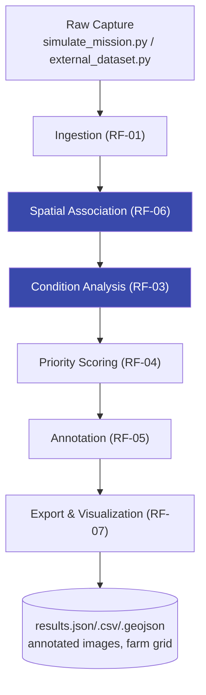

# Sunnybotics — Solar Panel Image Capture & Condition Mapping

A pipeline for a cleaning/inspection robot: given a photo, figure out which panel it
is, what condition it's in, and what to do about it — with evidence behind every call.

Status: RF-01 through RF-07 built and running end to end, validated on both a
simulated mission and Sunnybotics' real sample dataset. Report and demo video are
still open.

## Quick start

```bash
pip install -r requirements.txt
python3 scripts/run_pipeline.py               # synthetic mission (default, main deliverable)
python3 scripts/run_pipeline.py --external    # Sunnybotics' real clean/damaged photos
```

Both modes run the same ingest → associate → classify → score → annotate → export
pipeline, writing to `data/<mode>/` and `outputs/<mode>/` so they never collide.
`--synthetic` is the full end-to-end validation (GPS, odometry, panel association, all
5 condition categories, injected edge cases). `--external` has no GPS/route/panel data
at all, so it validates one narrower thing instead — real-photo clean/damaged
classification — see [Results](#results) below.

To run `--external`, clone the sample dataset first:

```bash
git clone https://github.com/roboticsSunnyApp/sunnybotics-solar-panel-challenge \
    data/external/sunnybotics-solar-panel-challenge
```

If it's missing, the pipeline fails loudly with that exact command rather than
skipping silently.

Tests (40 total, all passing):

```bash
python3 -m unittest tests.test_pipeline -v
python3 -m unittest tests.test_external_dataset -v
python3 -m unittest tests.test_external_classifier -v
```

## Architecture



Each stage writes its own CSV and owns its own logic — nothing downstream re-derives
what an earlier stage decided. Association and condition analysis (highlighted) carry
the most rubric weight and got the most iteration.

## Results

### Synthetic mission (full pipeline validation, 100 images)

| Metric | Value |
|---|---|
| Spatial association accuracy | 100% |
| Condition accuracy, overall | 86.3% (clean 100 / dirt 75.7 / shadow 75 / glare 100 / damage 88.9%) |
| Injected edge cases caught | 5 / 5 |

### Real photos, external mode (119 images, 31 clean / 88 damaged)

The synthetic-calibrated rule classifier doesn't transfer zero-shot — its thresholds
assume a clean image measures exactly zero on every signal, which is true for a
synthetic render and true for no real photo. Run unmodified against real images, it
returns `uncertain` for all 119. That's reported honestly (`external_eval_summary.json`)
rather than patched around; a later attempt to fix it by recalibrating thresholds per
batch was tried, scored *below* naive baselines, and was dropped.

What actually works is a supervised benchmark instead: logistic regression on the same
10 features the rule classifier uses, 5-fold stratified cross-validation, no folder
label ever touching inference.

| Metric | Value |
|---|---|
| Cross-validated accuracy | **86.6%** (95% CI, Wilson score: 79.3–91.6%) |
| Majority-class baseline | 73.9% |
| Clean / Damaged F1 | 75.0% / 90.8% |

Above baseline even at the low end of the interval. Two things worth knowing from the
diagnostics: confidence tracks correctness (top 20% most-confident predictions hit
95.8% accuracy, bottom 20% hit 75%), and `damage_line_density` — the feature the
*rule-based* damage detector is built around — pushes toward "clean" in this model,
not "damaged." The classical line-density signal doesn't mean the same thing outside
the synthetic renderer; the supervised model leans on dirt/shadow/glare area instead.
Full numbers in `outputs/external/external_binary_eval_summary.json`.

None of this is a production accuracy claim — it's a cross-validated result on ~120
real images, answering clean-vs-damaged only.

## Design decisions

- **Kalman filter, not nearest-neighbor, for panel association.** GPS alone (1–3m
  error against a 2.2m panel pitch) can't reliably separate adjacent panels, and a GPS
  bias shifts a whole row the same way. A per-row-pass filter fuses odometry (predict)
  with GPS (correct). Reported confidence is a separately bias-floored value, not the
  filter's raw uncertainty — using the raw value let repeated GPS updates look
  confident even under a bias the filter never saw, which showed up for real in one
  simulated mission and got flagged for review instead of silently trusted.
- **Classical CV, not a trained model, for condition analysis.** A learned model risks
  just memorizing this project's own image generator instead of anything about solar
  panels. Four heuristics, each tied to a real physical signature, each measured
  against that image's own baseline. Damage detection went through three real fixes
  (a border-exclusion filter too aggressive, a corrupted calibration image, an RNG
  coupling bug) taking it from 55.6% to 88.9% — by fixing the detector, not loosening
  a threshold.
- **Ground truth never touches inference**, in either mode. The synthetic and real
  labels each live in their own file, joined back in only at evaluation time. This
  isn't just a design note — it's tested structurally (the label column literally
  isn't in the inference dataframe) and behaviorally: the external classifier's CV
  code was mutation-tested by deliberately reintroducing two different leaks and
  confirming the tests actually caught them before trusting the guarantee.
- **Priority scores map to an action, not a dressed-up confidence.** Damage floors
  high regardless of confidence (missing a crack is expensive); dirt scales by
  measured area; genuinely uncertain results always route to human review, never
  auto-cleaning.
- **Mode-scoped, not mode-specific.** `ingest → associate → condition → priority →
  annotate → export` is identical code for both a fully-instrumented simulated
  mission and a flat folder of real phone photos with no metadata at all — only the
  data-acquisition adapter differs.

## Repo layout

```
src/
  config.py                    every tunable constant + mode-scoped paths
  simulate_mission.py           RF-01/02: synthetic dataset generator
  ingest.py                     RF-01: validation, tags rather than drops
  associate_panels.py           RF-06: GPS+odometry fusion, panel identity
  feature_extraction.py         RF-03: raw CV measurements
  condition_analysis.py         RF-03: rule-based classifier
  priority_score.py             RF-04: condition -> operational decision
  annotate.py, export.py, visualize.py   RF-05/07
  external_dataset.py           adapts real photos into the same schema
  external_classifier.py        supervised clean/damaged benchmark (external only)
scripts/run_pipeline.py         --synthetic / --external
tests/                          40 tests across 3 files
data/{synthetic,external}/      generated intermediates + cloned real dataset
outputs/{synthetic,external}/   annotated images, evidence, results, benchmarks
```

## Known limitations

- All synthetic numbers are simulation-only validation, not a real-world accuracy
  claim — the external benchmark above is the real-photo evidence.
- Damage detection is the most-improved category (55.6% → 88.9%) but the smallest
  sample (9 evaluable images), so it's a good result, not a statistically large one.
- "Panel not visible" isn't testable on the synthetic data — every image is a panel
  by construction. A real deployment needs an actual panel-detection stage.
- Lat/lon is a flat-earth approximation (fine at farm scale), odometry drift isn't
  modeled over long distances, and a GPS bias larger than half a panel pitch can be
  detected but not corrected without an external reference.
- External mode has no GPS/route/panel/mission metadata — `association_status` is
  `unresolvable` for every row by design, and `timestamp`/`robot_id`/`mission_id` are
  clearly-named placeholders, never implied to be real.
- 10 of Sunnybotics' 129 sample images are `.HEIC`, which this project's OpenCV build
  can't decode — skipped and logged, not silently dropped.

## Process note

Built with AI pair-programming assistance, disclosed as the brief allows. The design
decisions are mine to defend — the assistant helped move faster and pushed back on
the design, which is how several of the bugs above got caught in the first place.

## What's left

- [ ] 2-page technical report
- [ ] 3-minute demo video
