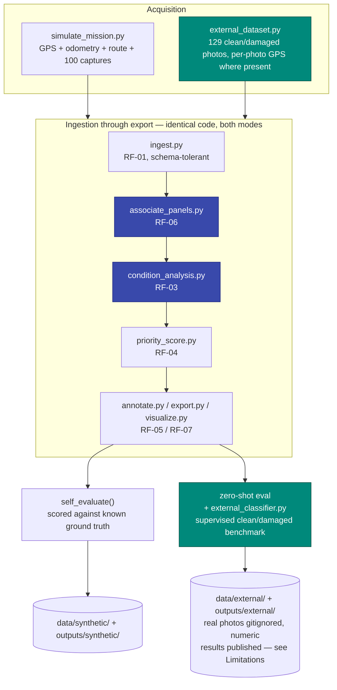
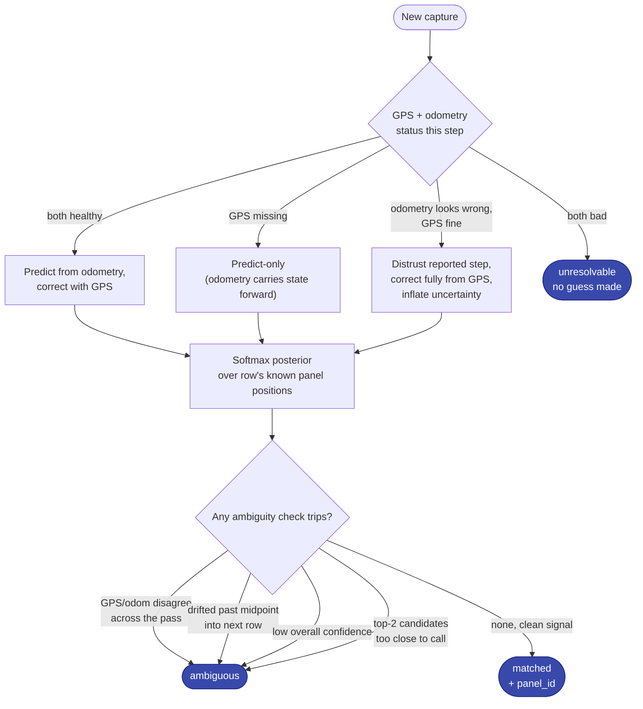
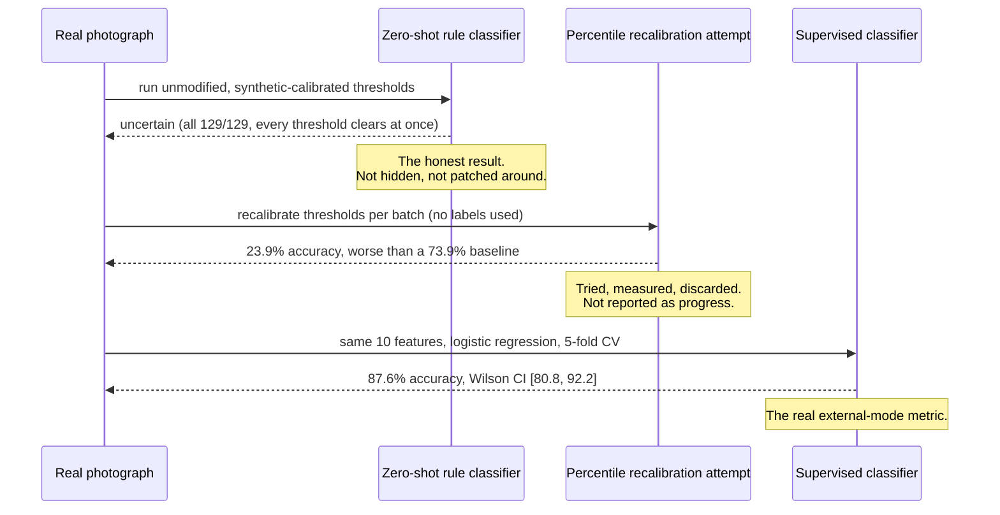

# Sunnybotics — Solar Panel Image Capture & Condition Mapping


A perception-to-decision pipeline for solar-farm operations and maintenance. Give it a photo and it tells you three things: which panel it is, what condition that panel is in, and what to actually do about it — clean, inspect, human review, or recapture — with the evidence behind every call, end to end from raw capture to a traceable, exportable result.

This is my submission for Sunnybotics' internship technical challenge. I built it as two separate pipelines: one for a fully simulated mission (GPS, odometry, route telemetry, injected sensor faults), and a second one built specifically for Sunnybotics' own real sample photographs, since real images call for a genuinely different approach than a synthetic renderer does. Both are documented here in full, side by side, with an honest account of how they compare.

## Table of Contents

- [Quick Start](#quick-start)
- [Architecture](#architecture)
  - [Panel Association: the Decision Logic](#panel-association-the-decision-logic)
- [Results](#results)
  - [Synthetic Mission](#synthetic-mission-full-pipeline-validation-100-images)
  - [Real Photographs](#real-photographs-external-mode-129-images-41-clean--88-damaged)
  - [Building the Real-Photo Classifier](#building-the-real-photo-classifier)
- [Design Decisions](#design-decisions)
- [Repo Layout](#repo-layout)
- [Deliverables Checklist](#deliverables-checklist)
- [Testing](#testing)
- [Known Limitations](#known-limitations)
- [Process Note](#process-note)
- [Why I'm Sharing This](#why-im-sharing-this)

## Quick Start

```bash
pip install -r requirements.txt
python3 scripts/run_pipeline.py               # synthetic mission (default, main deliverable)
python3 scripts/run_pipeline.py --external    # Sunnybotics' real clean/damaged photos
```

Both modes run the same `ingest → associate → classify → score → annotate → export` pipeline, writing to `data/<mode>/` and `outputs/<mode>/` so a run of one never touches the other. `--synthetic` is the full end-to-end validation: GPS, odometry, panel association, all 5 condition categories, injected edge cases. `--external` has no route or panel-level ground truth, though most individual photos carry their own GPS EXIF. It validates something narrower and, honestly, more important: whether the visual classifier actually works on a real photograph. See [Results](#results).

To run `--external`, clone the sample dataset first:

```bash
git clone https://github.com/roboticsSunnyApp/sunnybotics-solar-panel-challenge \
    data/external/sunnybotics-solar-panel-challenge
```

If it's missing, the pipeline fails loudly with that exact command instead of skipping silently.

```bash
# 40 tests, 3 files
PYTEST_DISABLE_PLUGIN_AUTOLOAD=1 python3 -m pytest tests/ -v
```

The env var works around an `anyio`/`pytest` version conflict in this environment's system packages. It has nothing to do with this project's own code.

## Architecture

Two capture sources feed one identical pipeline. A simulated mission generates GPS, odometry, and route telemetry from scratch for 100 captures. The real photographs Sunnybotics sent carry no route or panel telemetry, just a clean/damaged folder split for 129 images (119 JPEG + 10 HEIC, decoded via `pillow-heif`) — most with their own per-photo GPS EXIF, extracted honestly where present. Everything past acquisition (ingestion, panel association, condition analysis, priority scoring, annotation, export) runs the same code path either way. None of those stages branch on which mode they're in by name; each one checks which columns are actually present in the incoming data and adapts. Only acquisition and the final evaluation step genuinely differ, because that's the only place they have to.



Two modules exist only for the real-photo path: `external_dataset.py` adapts real files into the same schema everything downstream already expects, and `external_classifier.py` is the supervised benchmark described below. Everything else in the diagram is a single shared implementation.

### Panel Association: the Decision Logic

This is the highest-weighted single requirement in the rubric (RF-06 / D2, 20 of 100 points), so it earns its own diagram. GPS alone (1–3 m of error against a 2.2 m panel pitch) cannot say which panel a photo belongs to. The system fuses GPS with odometry through a per-route-pass Kalman filter, treats the result as a probability over known panel positions rather than a lookup, and downgrades to "ambiguous" instead of guessing whenever it doesn't have enough signal to be sure.



On the synthetic set, where the true answer is known: 49 of 100 captures matched with confidence, 51 were flagged ambiguous, and the top-1 guess was correct in both groups, 100% of the time. It isn't just accurate. It recognizes exactly the cases where it doesn't have enough signal to be sure, which is the part I'd defend hardest. One honest limitation worth stating plainly here: this logic is validated only against this project's own simulator noise model. Most photos in the real dataset Sunnybotics sent do carry their own GPS EXIF, but there's no route structure or panel-level ground truth to match a coordinate against, so it still can't exercise this part of the system by itself. No public dataset provides panel-level GPS ground truth at solar-farm scale either, so real validation of this specific piece would need Sunnybotics' own field logs.

## Results

### Synthetic mission (full pipeline validation, 100 images)

| Metric | Value |
|---|---|
| Spatial association, top-1 accuracy (matched group) | 100% |
| Spatial association, top-1 accuracy (ambiguous group) | 100% |
| Condition accuracy, overall | 86.3% (clean 100 / glare 100 / damage 88.9 / dirt 75.7 / shadow 75.0%) |
| Deliberately broken images injected | 8, across 2 mechanisms (see [Known Limitations](#known-limitations)) |
| Tests passing | 40 / 40 |

### Real photographs, external mode (129 images, 41 clean / 88 damaged)

The rule-based classifier above was calibrated for the synthetic renderer, and a real photo needs a genuinely different approach, so I built a dedicated model for this half of the problem. Before building it, I ran the original rule classifier against all 129 real photos as a diagnostic step: its thresholds assume a clean image measures exactly zero on every signal, true for a synthetic render, true for no real photo, so it comes back `uncertain` for every one, both true-clean and true-damaged alike. That result is reported honestly rather than patched around. I also tried recalibrating its thresholds per batch as a first attempt; it scored *below* naive baselines (23.9% against a 73.9% majority-class floor, on the original 119-image sample), so I dropped it and moved to building something purpose-made for real images instead.

What I built for that is a second model: logistic regression on the same 10 features the rule classifier uses, 5-fold stratified cross-validation, no folder label ever touching inference.

| Metric | Value |
|---|---|
| Cross-validated accuracy | **87.6%** (Wilson 95% CI: 80.8–92.2%) |
| Majority-class baseline | 68.2% |
| Clean, precision / recall / F1 | 79.1% / 82.9% / 81.0% |
| Damaged, precision / recall / F1 | 91.9% / 89.8% / 90.8% |
| Confidence-stratified accuracy | top 20% → 96.2%, middle 60% → 88.3%, bottom 20% → 76.9% |

That clears the baseline even at the low end of the confidence interval, and confidence genuinely tracks correctness, which makes it usable for triage. Full numbers live in `outputs/external/external_binary_eval_summary.json`.

One finding worth calling out on its own: `damage_line_density`, the feature the rule-based damage detector is actually built around, pushes toward **clean** in the supervised model, not damaged. The classical line-density signal doesn't mean the same thing outside the synthetic renderer. The real-photo model leans on dirt, shadow, and glare area instead, and I would not have found this without looking at the model's own coefficients.

### Building the Real-Photo Classifier



Every step in that chain actually ran against the real dataset. None of it is projected or estimated.

## Design Decisions

- **Kalman filter, not nearest-neighbor, for panel association.** GPS alone can't reliably separate adjacent panels at this pitch, and a GPS bias shifts a whole row the same way. A per-route-pass filter fuses odometry (predict) with GPS (correct). Reported confidence is a separately bias-floored value, not the filter's raw uncertainty. Using the raw value let repeated GPS updates look confident even under a bias the filter never saw, which showed up for real in one simulated mission and got flagged for review instead of silently trusted.
- **Classical CV, not a trained model, for the condition classifier.** A learned model risks memorizing this project's own image generator instead of anything about solar panels. Four heuristics, each tied to a real physical signature, each measured against that image's own baseline. Damage detection went through three real fixes (a border-exclusion filter that was too aggressive, a corrupted calibration image, an RNG coupling bug), taking it from 55.6% to 88.9% by fixing the detector, not loosening a threshold.
- **Ground truth never touches inference**, in either mode. The synthetic and real labels each live in their own file, joined back in only at evaluation time. This is tested structurally, since the label column literally isn't in the inference dataframe, and behaviorally: the external classifier's cross-validation code was mutation-tested by reintroducing two different leaks and confirming the tests actually caught both before trusting the guarantee.
- **Priority scores map to an action, not a dressed-up confidence.** Damage floors high regardless of confidence, since missing a crack is expensive. Dirt scales by measured area, not classifier confidence. Genuinely uncertain results always route to human review, never auto-cleaning.
- **Mode-scoped, not mode-specific.** `ingest → associate → condition → priority → annotate → export` is identical code for a fully-instrumented simulated mission and a flat folder of real phone photos with no metadata at all. Only the acquisition adapter and the final evaluation step differ, as shown in the diagram above.

## Repo Layout

```
src/
  config.py                    every tunable constant + mode-scoped paths
  simulate_mission.py           RF-01/02: synthetic dataset generator
  ingest.py                     RF-01: validation, tags rather than drops
  associate_panels.py           RF-06: GPS+odometry fusion, panel identity
  feature_extraction.py         RF-03: raw CV measurements
  condition_analysis.py         RF-03: rule-based classifier
  priority_score.py             RF-04: condition -> operational decision
  annotate.py, export.py, visualize.py   RF-05/07
  external_dataset.py           adapts real photos into the same schema
  external_classifier.py        supervised clean/damaged benchmark (external only)
scripts/run_pipeline.py         --synthetic / --external
tests/                          40 tests across 3 files
report/                         2-page IEEE-format technical report (.tex + .pdf + figures)
data/{synthetic,external}/      generated intermediates + cloned real dataset
outputs/{synthetic,external}/   annotated images, evidence, results, benchmarks
```

## Deliverables Checklist

Mapped directly to the brief's own deliverable IDs:

| ID | Deliverable | Status |
|---|---|---|
| E1 | Repository, organized source, dependencies, README | Done |
| E2 | Structured results (`results.csv/json/geojson`, all required fields) | Done, both modes |
| E3 | Annotated images (`outputs/*/annotated/`) | Done, both modes |
| E4 | Visualization (farm grid, static + interactive) | Done |
| E5 | Technical report, 2 pages | Done, `report/report.pdf`, IEEE format |
| E6 | Final video, 3 minutes | Done |

## Testing

40 tests across 3 files, all passing:

```bash
PYTEST_DISABLE_PLUGIN_AUTOLOAD=1 python3 -m pytest tests/test_pipeline.py -v            # 6 tests
PYTEST_DISABLE_PLUGIN_AUTOLOAD=1 python3 -m pytest tests/test_external_dataset.py -v    # 14 tests
PYTEST_DISABLE_PLUGIN_AUTOLOAD=1 python3 -m pytest tests/test_external_classifier.py -v # 20 tests
```

The tests that matter most aren't just written, they're mutation-tested. The cross-validation leakage-proof tests were checked by deliberately reintroducing two different real leaks (held-out labels passed into scoring, and fitting on the full dataset instead of the training fold) one at a time, confirming both were actually caught, then reverting. That's the difference between a test that looks right and one that's actually been watched to fail.

## Known Limitations

- Synthetic numbers are simulation-only validation. The external benchmark above is the real-world evidence.
- **RF-06's panel association is validated only against this project's own simulator noise model.** Most of Sunnybotics' real sample photos do carry their own GPS EXIF, but there's no route structure or panel-level ground truth to exercise this against, and no public dataset fills that gap either. Closing it for real would need Sunnybotics' own field logs. Named here directly since it's the single highest-weighted item in the rubric.
- Damage detection's jump from 55.6% to 88.9% comes from 9 evaluable images. A real result, not a large-sample one.
- External mode's `timestamp`/`robot_id`/`mission_id` fields are placeholders by design, since the real dataset carries none of that metadata. "Panel not visible" isn't testable on synthetic data either, since every image is a panel by construction.
- This repo is public. Sunnybotics' real photos stay out of it by design (see [Architecture](#architecture)); the numeric results derived from them are published in full.

## Process Note

Built with AI pair-programming assistance, disclosed as the brief allows. The design decisions are mine to defend. The assistant helped me move faster and pushed back on the design, which is how several of the bugs above got caught in the first place.

## Why I'm Sharing This

Nothing in this repo is dressed up. The 100% synthetic association number is real, and so is the fact that real photos needed a purpose-built model instead of a tweaked threshold, which is exactly why that model exists. Both are in here, side by side, because a system that only reports its wins isn't one anyone should trust with thousands of panels, and because I'd rather defend a smaller number I can stand behind than a bigger one I can't.

That's the standard I held this build to end to end: fix the actual detector instead of loosening a threshold, mutation-test a leakage proof instead of trusting that it reads correctly, name the one validation gap that matters most instead of hoping nobody asks. If this approach holds up to scrutiny, I'd welcome the chance to help build the real version of it with your team, at actual solar-farm scale rather than a simulated one.

— Mohammed Rayan
