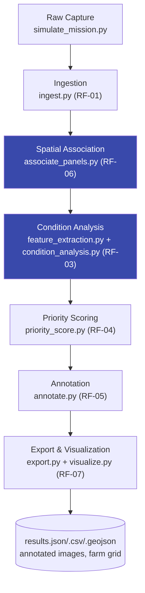
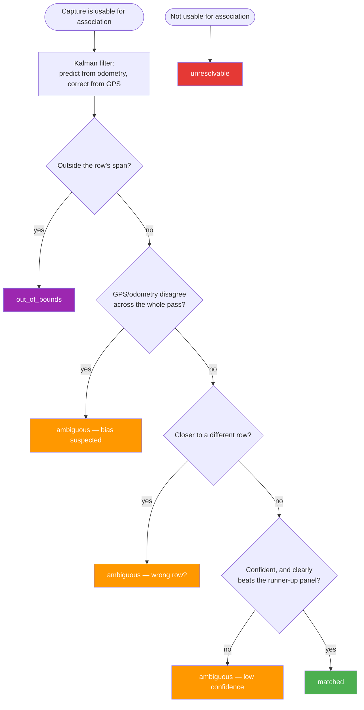
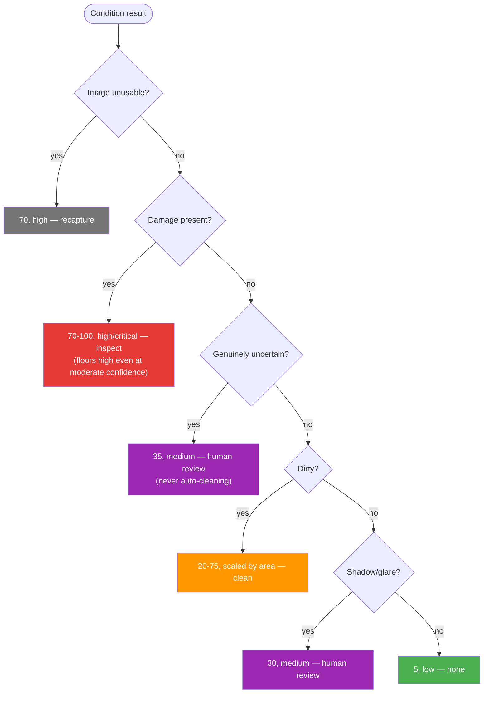

# Sunnybotics — Solar Panel Image Capture & Condition Mapping

A pipeline that takes panel images from a cleaning/inspection robot and answers three
things for each one: where it was taken, what condition the panel is in, and what
evidence backs that call.

Status: RF-01 through RF-07 are built and running end to end. Still to do: the
2-page report and the demo video.

## Quick start

```bash
pip install -r requirements.txt
python3 scripts/run_pipeline.py
```

That's the whole thing — simulate, ingest, associate, classify, score, annotate,
export, visualize. Fully deterministic, fixed seed — `image_id` included, not just
the statistics. That's not automatic with Python's `uuid.uuid4()` (it draws from OS
entropy, not the seed), so `image_id` is instead derived from the same seeded
generator as everything else. Confirmed by running the pipeline twice back to back
with no wipe in between: identical 100 image_ids both times, `outputs/annotated/`
stayed at 100 files rather than accumulating a second generation under new names —
an earlier version of this pipeline didn't have that property; it was found and
fixed during review. Each stage also runs standalone via `python3 -m src.<module>`
if you want to poke at one piece.

Tests: `python3 -m unittest tests.test_pipeline -v` — six checks, including one
regression test tied to a real bug caught during this build (see below).

## Why everything is simulated

No dataset ever arrived from Sunnybotics, despite the brief saying one would. The
brief itself allows simulated data as long as assumptions are stated, so that's the
route taken here — every simulation parameter lives in `src/config.py`, documented
and calibrated against the data it actually produces rather than guessed.

## Architecture



Each stage writes its own CSV and owns its own logic; nothing downstream re-derives
what an earlier stage already decided. Association and condition analysis (highlighted)
carry the most weight in the rubric and got the most iteration — see below.

## Repo layout

```
src/
  config.py                  # every tunable constant, calibrated not guessed
  farm_layout.py, gps_model.py, odometry_model.py, image_synth.py
  simulate_mission.py         # RF-01/02: generates the whole synthetic dataset
  ingest.py                   # RF-01: validation, never silently drops a row
  associate_panels.py         # RF-06: GPS+odometry fusion, panel identity
  feature_extraction.py       # RF-03: raw CV measurements
  condition_analysis.py       # RF-03: classifies from those measurements only
  priority_score.py           # RF-04: condition -> operational decision
  annotate.py, export.py, visualize.py   # RF-05/07
scripts/run_pipeline.py       # one command, start to finish
tests/test_pipeline.py        # python3 -m unittest tests.test_pipeline -v
data/                         # generated intermediate CSVs + raw images
outputs/
  annotated/                  # one annotated image per capture
  evidence/                   # condition masks + feature JSON per image
  visualizations/             # farm_grid.png, farm_grid_interactive.html
  results.{json,csv,geojson}
```

## What's actually in `outputs/` right now

Checked against a clean run, not assumed:

- `results.csv` — 100 rows, 19 columns
- `results.json` / `results.geojson` — same 100 rows, both formats
- `outputs/annotated/` — 100 images (placeholders for the 2 deliberately-broken files)
- `outputs/visualizations/` — farm grid PNG + a self-contained interactive HTML

**Validation summary** (all simulation-only — see [Known limitations](#known-limitations)):

| Metric | Value |
|---|---|
| Association accuracy (matched + ambiguous) | 100% |
| Condition classification accuracy, overall | 86.3% |
| — clean / dirt / shadow / glare / damage | 100% / 75.7% / 75% / 100% / 88.9% |
| Deliberately-injected bad inputs caught | 5 / 5 |
| Final exported records | 100 |

## How each piece works

### Data & ingestion (RF-01/RF-02)

The farm is 50 panels (5×10) laid out in a local flat coordinate frame rather than raw
lat/lon — easier to reason about distances and it's how you'd actually do this on a
robot. Two simulated sensors feed into everything downstream: GPS (with a per-mission
bias plus per-fix jitter, not just noise) and wheel odometry, which doesn't share
GPS's bias — that split matters a lot later.

Two missions run over the farm (morning and solar-noon), and panel conditions are
split into what's persistent (dirt, damage — same across both missions) and what's
transient (shadow, glare — re-rolled per mission from the sun angle). That's what
lets the system tell real dirt apart from a passing shadow later, instead of just
asserting it can.

Ingestion (`ingest.py`) checks every row for bad metadata, bad coordinates, and
unreadable images, and tags rather than drops anything. One thing worth knowing: PIL's
`Image.verify()` doesn't actually catch a truncated JPEG — confirmed by testing it
against a genuinely truncated file, which sailed through `.verify()` fine. A full
`.load()` does raise. Five injected edge cases (missing file, truncated file, GPS
dropout, bad coordinates, missing mission_id) all get caught correctly.

### Spatial association (RF-06)

This is the highest-weighted part of the rubric, so it got the most care. GPS alone
(1–3m error against a 2.2m panel pitch) can't reliably tell adjacent panels apart, and
a GPS bias can shift an entire row's readings the same way — so nearest-neighbor
matching isn't good enough. Instead, a small Kalman filter runs per row pass, using
odometry to predict position and GPS to correct it, then turns the fused estimate
into a probability over that row's known panels.



One thing that genuinely tripped this up during development: using the Kalman
filter's own uncertainty directly for confidence turned out to be wrong, because
repeated GPS updates shrink that uncertainty even when there's a GPS bias the filter
never sees. The fix keeps the filter's internal math untouched but reports a
separately-floored, bias-aware confidence — so it doesn't get quietly overconfident
under exactly the failure mode it's supposed to guard against.

That failure mode also actually showed up in this run: mission M02 happened to draw
a GPS bias large enough to trip the disagreement check, and all 50 of its images got
flagged `ambiguous`. Checked against ground truth, every one of them was still
correctly matched to its panel — odometry dominates the fusion, so the bias didn't
actually break anything, but the system flagged it for review anyway rather than
silently trusting a GPS reading it had reason to doubt.

### Condition analysis (RF-03)

The obvious trap here is a classifier that's really just learning this project's own
image generator instead of anything about solar panels. So there's no trained model —
four classical CV heuristics, each tied to a real physical signature (shadow drops
brightness without shifting hue, dirt shifts hue and kills local contrast, glare
saturates a coherent blob, damage shows up as line geometry that doesn't fit the
panel's own grid), each measured against that image's own baseline rather than a
fixed template.

Two calibration bugs showed up when the numbers were actually checked instead of
trusted: the dirt detector was flagging clean images almost as often as dirty ones
(traced to hue becoming unstable on this project's very dark base color — fixed with
a local rather than global baseline), and the shadow detector was under-firing badly
on real shadows. Both are now well separated.

Damage detection used to be the clear weak point. It went through three rounds of
real fixes, each one found by checking actual output rather than trusting the design,
and it's no longer the weakest of the four.

Round one: the original approach (candidate lines that don't fit the grid's own
periodicity) genuinely overlapped between clean and damaged images — even a spotless
panel has thousands of grid-line edges swamping any real crack signal. Went back to
how the categories are actually rendered: crack lines are drawn near-black, while the
grid's own bus-bar lines are drawn *lighter* than the base fill — so a candidate line
markedly *darker* than the image's own baseline is a much cleaner, physically-grounded
signal than geometry alone. First test of this looked wrong (glare images scored
highest), which turned out to be a corrupted test file leaking into the calibration
set plus a glare-exclusion check that only looked at line endpoints. Fixed both:
clean/dirt/shadow/glare all measure exactly zero, damage ranges 0.0007–0.0029.
Damage accuracy: 55.6% → 66.7%.

Round two: fixing an unrelated reproducibility gap (`image_id` wasn't seeded — see
Known limitations for the full story) meant `image_id` generation had to draw from
the same random generator used for everything else, which shifted every downstream
random draw and silently changed the whole simulated dataset. Caught by comparing
accuracy numbers before and after a rerun and finding they didn't match. Fixed
properly by spawning image_id its own independent random stream, so touching ID
generation can never again perturb the substantive simulation.

Round three: with the dataset back to its real, correct numbers, looked directly at
a still-misclassified damage image — the crack was clearly visible by eye, but scored
zero damage signal. Traced it to the border-exclusion filter (added to stop the
image's own outer frame from being mistaken for a line) being too blunt: it excluded
any line with an endpoint *near* the border, not just lines that actually *trace* the
border — so a diagonal crack that happened to end near a corner got thrown out along
with the frame. Fixed by only excluding lines that are axis-aligned *and* both
endpoints sit near the same edge. Damage accuracy: 66.7% → **88.9%**.

Net result: damage went from the clear weak point to no longer being the weakest of
the four — dirt (75.7%) and shadow (75%) now are, tied. Not because those regressed,
but because damage improved past them. All three fixes were found by looking at real
output that didn't match expectations, not by adjusting a number until it looked
better.

Everything classifies from a saved features file, never from raw pixels directly —
so the decision logic is a plain function you can inspect, and every masked region
gets saved as an actual image under `outputs/evidence/`.

### Priority scoring (RF-04)

The score isn't a confidence number dressed up — it's tied to what you'd actually do
about it.



Damage gets a high floor regardless of confidence, because missing a real crack is
expensive and a false-positive inspection isn't. Dirt scales with measured area
rather than confidence, because cleaning urgency should track how soiled the panel
actually is. An unusable image never gets a cleaning score at all — it needs a
recapture, which is a different problem.

The branch order matters more than it looks: an earlier version checked for dirt
before checking whether the result was genuinely uncertain, and since almost every
uncertain case happens to also contain a dirt signal, the "uncertain" path would
never have fired. Fixed by checking uncertainty first (damage still overrides
everything, on purpose).

`recommended_action` is always a separate field from the score itself, specifically
so a 70 next to "recapture" never reads like "go clean this panel."

### Annotation, export, visualization (RF-05/RF-07)

Everything joins on `image_id`. The panel identity in the final export comes from
association's prediction, never ground truth — resolving that correctly is the
whole point of RF-06. GPS coordinates stay as the raw reading, kept separate from
the resolved panel position.

Annotated images show condition, confidence, priority, and panel identity (or a
clear warning if association isn't confident), with the actual evidence mask tinted
onto the photo. A missing image gets a placeholder with a recapture warning instead
of being skipped.

The farm grid — two side-by-side layouts, one per mission — turned out more useful
than a map here, since reprojecting a made-up coordinate onto a real map would just
be misleading. It comes as a static PNG and a self-contained interactive HTML with a
dropdown to recolor by condition, priority, or association status.

One real bug from this stage: a cell in the grid rendered blank. Traced it to the
same missing-`mission_id` row injected back in Section 1 — it survived every earlier
stage fine, but the grid's mission grouping silently dropped anything without a
clean `mission_id`. Fixed by recovering it from `route_pass_id`, which wasn't
touched by that particular edge case.

## Known limitations

- **All imagery is synthetic.** Every accuracy number in this project is a
  simulation-only validation of the method, not a real-world accuracy claim.
- **Damage detection is no longer the weakest detector, but it's not solved either.**
  It went from 55.6% to 88.9% across three rounds of real fixes (see RF-03 walkthrough
  above) — dirt and shadow are now the lower-accuracy categories instead. Damage still
  shows up as a secondary signal on a small number of glare/shadow/dirt images that
  aren't actually damaged, which is why `priority_score.py` explicitly distinguishes
  "damage is the primary finding" from "damage is a secondary, unconfirmed signal" in
  `priority_reason` rather than implying confirmed damage either way. A real
  deployment would still benefit from crack-labeled training imagery for a proper
  learned detector — a trained model would help, but reintroduces the "is it actually
  learning solar panels" problem this project was built to avoid, so it's a genuine
  tradeoff, not a free upgrade. And the 10-image damage sample size in this dataset is
  small enough that "88.9%" means 8 out of 9 evaluable images — a good result, not a
  large one statistically.
- **"Panel not visible" isn't really testable here.** Every synthetic image is a
  panel by construction, so there's no negative example to validate against. A real
  deployment would need an actual panel-detection stage.
- The lat/lon conversion is a flat-earth approximation, fine at farm scale, not at
  kilometer scale.
- Odometry drift isn't modeled over long distances — fine for one ~20m row pass.
- A GPS bias bigger than half a panel pitch can be detected but not corrected
  without an external reference point this design doesn't have.
- Priority scoring doesn't discount for a shaky panel association — it notes it in
  `priority_reason` instead, since spatial and visual confidence are separate
  questions.
- The interactive farm grid bundles Plotly's JS to stay self-contained, so the HTML
  file is a few MB.

## A note on process

Built with AI pair-programming assistance, as the brief allows, with disclosure. The
design decisions are mine to defend — the assistant mostly helped move faster and
push back on the design, which is how a few of the bugs above got caught in the
first place.

## What's left

- [ ] 2-page technical report, including the six required questions
- [ ] 3-minute video, showing the system running and at least one failure case live
